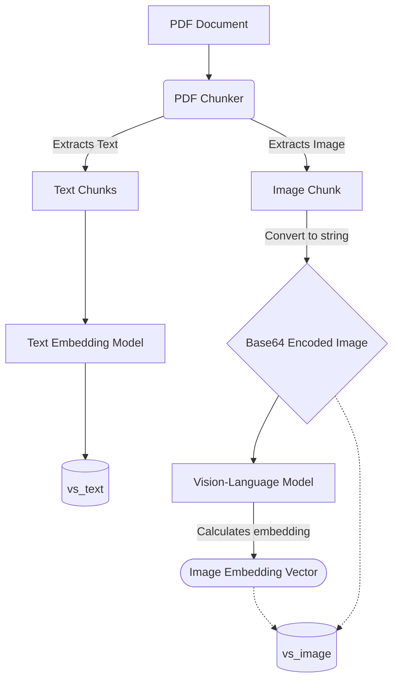
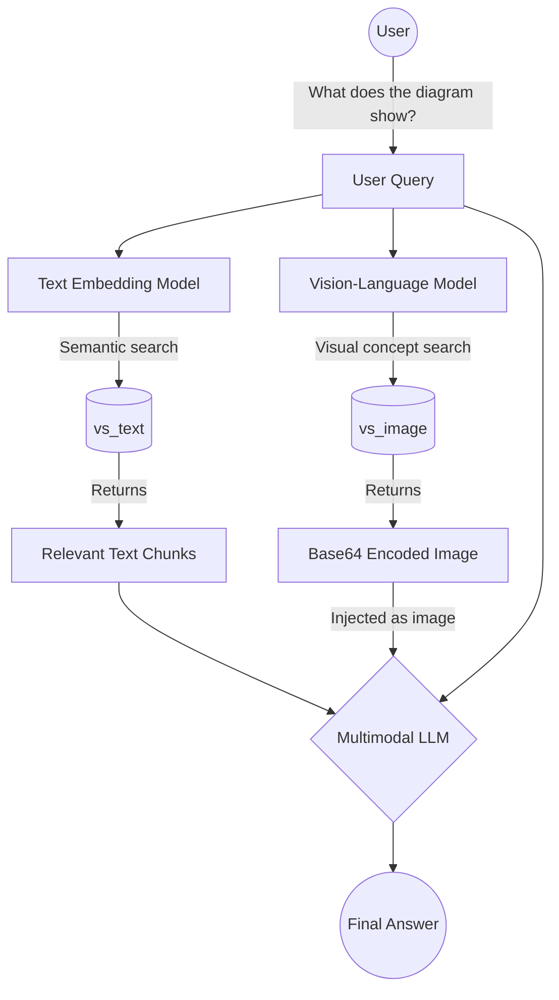

# Technical Design: Multimodal Image Retrieval

_Status: design approved, implemented in v0.2.30_

---

## 1. Problem Statement

PDFs in technical and sustainability corpora contain data tables, specification charts, and diagrams rendered as images. These are currently lost at ingest time. `PDFChunker` extracts them as base64 `Chunk` objects with `mime_type="image/png"`, but `build_vector_store` silently drops anything that is not `text/*` (line 641 of `feature0_baseline_rag.py`). Standalone image files (`.png`, `.jpg`, etc.) are skipped with a warning at line 446.

The `RAG` agent already has the injection code for image sources (`<source type='image'>` with multipart content). `Qwen3VLEmbeddings` is fully implemented. The plumbing exists; it is just not connected.

---

## 2. Decision

**Option C — dual collection with toggle** (from UPSTREAM_SYNC_PLAN.md).

- Text chunks → `vs_text` (nomic SentenceTransformer, unchanged).
- Image chunks → `vs_image` (Qwen3VL-Embedding-2B, separate ChromaDB collection).
- Retrieved images injected as base64 into LLM context — requires a multimodal answering LLM (e.g. `qwen2.5vl:7b`, `minicpm-v`, `gemma4` via Ollama).
- **Off by default.** Enabling requires: GPU, Qwen3VL embedding model, multimodal answering LLM.
- Two independent KB-level toggles: one for indexing (`image_indexing_enabled`), one for retrieval (`image_retrieval_enabled`).
- Image retrieval top_k is a session-level parameter in `RagConfig`, configurable in the sidebar (range 1–4).

Option B (captioning pipeline) remains available as a future follow-up. Not in scope here.

---

## 3. Architecture Overview

### 3.1 Toggles

Two independent KB-level flags (stored in `knowledge_bases.json`):

| Flag | Controls | Where configured |
|---|---|---|
| `image_indexing_enabled` | Whether images are extracted from PDFs and standalone image files are loaded at ingest time | KB config panel |
| `image_retrieval_enabled` | Whether `vs_image` is instantiated and its results injected into the LLM context at query time | KB config panel |

The four possible states:

| `image_indexing_enabled` | `image_retrieval_enabled` | Behaviour |
|---|---|---|
| false | false | Current text-only behaviour. Zero overhead. |
| true | false | Images indexed into `vs_image`, never queried. Useful: build index on GPU now, enable retrieval later without re-indexing. |
| false | true | Retrieval reads `vs_image` if it exists from a prior indexing run. No new images extracted on re-index. |
| true | true | Full multimodal pipeline. |

When both are off the system behaves exactly as today. Neither flag requires the other to be set.

Additional components required when either flag is on:

| Component | Value |
|---|---|
| Image embedding model | `Qwen/Qwen3-VL-Embedding-2B` (configurable via `image_embedding_model`) |
| Image vector store | ChromaDB collection at `<vs_path>_images` (derived, not user-configured) |
| Answering LLM (retrieval only) | Must be multimodal — configured in session config as usual |

`image_embedding_model` is shared by both flags: the model used to index must be the same model used to query. The field is shown in the KB panel whenever either toggle is on.

**Session-level parameter** (in `RagConfig`, shown in the sidebar):

| Field | Default | Range | Notes |
|---|---|---|---|
| `image_retriever_top_k` | 1 | 1–4 | How many image chunks to inject per query. Only relevant when `image_retrieval_enabled` is on. |

### 3.2 VS Path Convention

The image vector store path is derived from the text store path:

```
vs_path (text):   db/vs_<slug>
vs_path (images): db/vs_<slug>_images
```

No extra config field. On KB deletion, both directories are removed.

### 3.3 Ingestion Flow (`image_indexing_enabled=True`)

```
PDF
 └─ PDFChunker(write_images=True, do_ocr=...)
     ├─ text chunks (mime_type="text/markdown")  → nomic embedding → vs_text
     └─ image chunks (mime_type="image/png")     → Qwen3VL embedding → vs_image

Standalone image files (.png, .jpg, ...)
 └─ loaded as Chunk(content=base64, mime_type="image/png") → vs_image
```

When `image_indexing_enabled=False`, `write_images=False` is passed to `PDFChunker` and standalone image files are skipped (current behaviour, made explicit).

### 3.4 Retrieval Flow (`image_retrieval_enabled=True`)

```
User query
 ├─ nomic.embed(query) → vs_text.search(top_k=retriever_top_k)          ─┐
 └─ Qwen3VL.embed(query) → vs_image.search(top_k=image_retriever_top_k) ─┴─ asyncio.gather → merge → LLM
```

Results are passed to the `RAG` agent as a flat list of `ChunkRecord` objects. The agent already handles `text/*` and `image/*` mime types in separate injection paths.

---

## 4. File-by-File Changes

### 4.1 `kb_router.py` — KB data model

Add three fields to `KBCreate`:

```python
image_indexing_enabled: bool = False
image_retrieval_enabled: bool = False
image_embedding_model: str = "Qwen/Qwen3-VL-Embedding-2B"
```

`KBInfo` inherits all three (it subclasses `KBCreate`). No other changes to the router — the fields are stored and returned with all KB API responses.

`delete_kb`: extend the ChromaDB cleanup to also remove the image store:

```python
if kb.vs_type == "chromadb":
    for vs_dir in [Path(kb.vs_path), Path(kb.vs_path + "_images")]:
        if vs_dir.exists():
            shutil.rmtree(vs_dir)
```

### 4.2 `feature0_baseline_rag.py` — factories and chunking

**`build_embedding_model` — add `"qwen3vl"` case:**

```python
elif backend == "qwen3vl":
    from conversational_toolkit.embeddings.qwen_vl import Qwen3VLEmbeddings
    name = model_name or "Qwen/Qwen3-VL-Embedding-2B"
    logger.info(f"Embedding backend: Qwen3VL ({name})")
    return Qwen3VLEmbeddings(model_name_or_path=name)
```

Import is deferred (inside the case) because loading `torch` + `transformers` at module import time costs several seconds even when the backend is not used.

**`load_chunks` — add `write_images` parameter:**

```python
def load_chunks(
    ...,
    write_images: bool = False,   # new
) -> list[Chunk]:
```

Pass it through to the PDF chunker:

```python
if file_path.suffix.lower() == ".pdf":
    kwargs["do_ocr"] = pdf_ocr_enabled
    kwargs["write_images"] = write_images
```

When `write_images=False`, `PDFChunker` defaults to `write_images=True` today — so without this change, image chunks would always be extracted (wasting CPU at ingest) and then dropped at line 641. Making it explicit and defaulting to `False` is intentional: the caller opts in.

**`_collect_candidate_files` — add `write_images` parameter:**

Standalone image files are not in `_CHUNKERS`, so `_collect_candidate_files` currently skips them entirely. They never enter the dedup pre-pass, are never hashed, and never reach `load_chunks`. Adding a `write_images` parameter fixes this:

```python
def _collect_candidate_files(
    data_dirs: list[Path],
    max_file_size_mb: float,
    max_files: int | None = None,
    write_images: bool = False,   # new
) -> list[Path]:
```

Inside the function, the existing `_IMAGE_EXTENSIONS` branch becomes:

```python
if ext in _IMAGE_EXTENSIONS:
    if write_images:
        candidates.append(f)   # include in dedup pre-pass and load_chunks
    else:
        logger.warning(f"Skipping image file (image retrieval disabled): {f.name}")
```

The pre-pass call in `_run_ingestion` passes the flag through:

```python
candidates = _collect_candidate_files(
    data_dirs,
    max_file_size_mb=kb.max_file_size_mb,
    write_images=kb.image_indexing_enabled,   # new
)
```

**`load_chunks` — standalone image file loading:**

Inside `load_chunks`, the existing dispatch block for unsupported extensions gains a branch:

```python
if ext in _IMAGE_EXTENSIONS:
    if write_images:
        b64 = base64.b64encode(file_path.read_bytes()).decode()
        file_chunks = [Chunk(
            content=b64,
            mime_type="image/png",
            title=file_path.name,
            metadata={"source_file": file_path.name},
        )]
    else:
        logger.warning(f"Skipping image file (image retrieval disabled): {file_path.name}")
        continue
```

The `file_hash` metadata key is stamped by the pre-pass and injected via the `file_hashes` dict already passed into `load_chunks` — same as for all other file types. No special handling needed.

### 4.3 `main.py` — component builder and ingestion

**`_build_components` — image retriever when retrieval toggle on:**

```python
if kb.image_retrieval_enabled:
    image_emb = build_embedding_model("qwen3vl", kb.image_embedding_model)
    image_vs = make_vector_store(
        vs_type=vs_type,
        db_path=Path(kb.vs_path + "_images") if vs_type == "chromadb" else None,
        embedding_model_name=kb.image_embedding_model,
        vs_connection_string=vs_conn,
        table_name=f"rag_{kb.id.replace('-', '_')}_images",
    )
    image_retriever = VectorStoreRetriever(image_emb, image_vs, top_k=cfg.image_retriever_top_k)
```

`cfg.image_retriever_top_k` comes from `RagConfig` (session config, default 1, range 1–4).

The final retriever passed to `CustomRAG` is `[final_retriever, image_retriever]` when image retrieval is on, or `[final_retriever]` when off. Image results bypass reranking — a text-based LLM reranker cannot score images meaningfully.

**`_run_ingestion` — image store build:**

```python
# Split after load_chunks
text_chunks = [c for c in chunks if c.mime_type.startswith("text")]
image_chunks = [c for c in chunks if c.mime_type.startswith("image")]

# Existing build — text only (unchanged)
await loop.run_in_executor(None, lambda: _sync_build_vs(text_chunks, vs_instance, emb))

# Image build — when indexing toggle on
if kb.image_indexing_enabled and image_chunks:
    image_emb = build_embedding_model("qwen3vl", kb.image_embedding_model)
    # Fetch existing hashes from vs_image separately — independent from vs_text hashes
    existing_image_hashes: set[str] = set()
    if not reset:
        image_vs_for_query = make_vector_store(
            vs_type=vs_type,
            db_path=Path(kb.vs_path + "_images") if vs_type == "chromadb" else None,
            embedding_model_name=kb.image_embedding_model,
            vs_connection_string=vs_conn,
            table_name=f"rag_{kb.id.replace('-', '_')}_images",
        )
        existing_image_hashes = await image_vs_for_query.get_file_hashes()

    def _sync_build_image_vs():
        new_loop = asyncio.new_event_loop()
        try:
            image_vs = make_vector_store(
                vs_type=vs_type,
                db_path=Path(kb.vs_path + "_images") if vs_type == "chromadb" else None,
                embedding_model_name=kb.image_embedding_model,
                vs_connection_string=vs_conn,
                table_name=f"rag_{kb.id.replace('-', '_')}_images",
            )
            return new_loop.run_until_complete(
                build_vector_store(
                    chunks=image_chunks,
                    embedding_model=image_emb,
                    db_path=Path(kb.vs_path + "_images"),
                    reset=reset,
                    existing_hashes=existing_image_hashes,
                )
            )
        finally:
            new_loop.close()
    await loop.run_in_executor(None, _sync_build_image_vs)
```

The image build is a second executor call, sequential after the text build. Parallelising the two executor calls is possible but not worth the complexity at this stage.

**`load_chunks` call site** — pass the indexing toggle:

```python
chunks = await loop.run_in_executor(
    None,
    lambda: load_chunks(
        ...,
        write_images=kb.image_indexing_enabled,   # new
    ),
)
```

### 4.4 `conversational-toolkit/agents/rag.py` — parallel retrieval

Replace the sequential retrieval loop:

```python
# Before (sequential)
sources: list[ChunkRecord] = []
for retriever in self.retrievers:
    retrieved = [await retriever.retrieve(q) for q in queries]
    if retrieved:
        sources += reciprocal_rank_fusion(retrieved)[:retriever.top_k]
```

```python
# After (parallel across retrievers)
import asyncio

async def _retrieve_one(retriever):
    results = await asyncio.gather(*[retriever.retrieve(q) for q in queries])
    return reciprocal_rank_fusion(list(results))[:retriever.top_k]

all_results = await asyncio.gather(*[_retrieve_one(r) for r in self.retrievers])
sources: list[ChunkRecord] = [chunk for group in all_results for chunk in group]
```

This fires all retrievers concurrently. Within each retriever, the per-query calls are also gathered (they already were in the original — `[await retriever.retrieve(q) for q in queries]` is a list comprehension with sequential awaits; with `asyncio.gather` they become truly parallel).

### 4.5 `rag_router.py` — session config

Add one field to `RagConfig`:

```python
image_retriever_top_k: int = Field(1, ge=1, le=4)
```

Persisted in `rag_config.json` alongside all other session parameters.

### 4.6 Frontend — KB config panel and sidebar

**KB config panel** — two new toggles near `pdf_ocr_enabled` (they are all ingest-related KB options). `image_embedding_model` text field shown only when either toggle is on.

**RAG config sidebar** — `image_retriever_top_k` slider/stepper (1–4), shown only when the active KB has `image_retrieval_enabled=true`. Lives near `retriever_top_k`.

Lang file additions (`en.ts`, `de.ts`, `fr.ts`, `it.ts`):

```typescript
// KB panel
fieldImageIndexing: "Image Indexing",
fieldImageIndexingHint: "Extract and embed images from PDFs at ingest time · requires GPU and Qwen3VL model",
fieldImageRetrieval: "Image Retrieval",
fieldImageRetrievalHint: "Query the image store and inject results into the LLM context · requires a multimodal answering LLM",
fieldImageEmbeddingModel: "Image Embedding Model",

// Sidebar
fieldImageRetrieverTopK: "Image Results (top k)",
fieldImageRetrieverTopKHint: "Number of images to retrieve per query · 1–4",
```

---

## 5. Metadata Lifecycle

Image chunks produced from a PDF share the same `source_file` and `file_hash` metadata as the text chunks from that PDF. This ensures:

- **Cross-run dedup**: if a PDF's hash is already in `vs_text`, it will also appear in `vs_image` — both stores skip it.
- **KB deletion**: `delete_kb` removes both `vs_path` and `vs_path + "_images"` directories.
- **Future document-level deletion** (`DELETE /api/v1/kb/{id}/documents/{document_id}`): must call `delete_chunks_by_document_id` on both stores. The design for that endpoint (in BACKLOG.md) should note this requirement.

---

## 6. `build_vector_store` — Minimal Change Required

`build_vector_store` is called twice from `_run_ingestion`: once with text chunks + text model + text VS, once with image chunks + image model + image VS. This keeps the function's responsibility narrow.

**The problem:** line 641 currently hardcodes a text-only filter:

```python
text_chunks = [c for c in chunks_to_embed if c.mime_type.startswith("text")]
```

Passing image chunks to `build_vector_store` as-is would silently drop them all. The fix is minimal — remove the filter and rename the variable, since the caller is now responsible for passing the correct set of chunks:

```python
# Before (line 641)
text_chunks = [c for c in chunks_to_embed if c.mime_type.startswith("text")]
for i in range(0, len(text_chunks), batch_size):
    batch = text_chunks[i : i + batch_size]

# After
for i in range(0, len(chunks_to_embed), batch_size):
    batch = chunks_to_embed[i : i + batch_size]
```

The nomic-prefix logic (`use_nomic_prefix`) is model-name-based, not mime-type-based, so it remains correct: it adds the prefix only when the embedding model is nomic, which will never be true for the Qwen3VL call. No other changes are needed inside `build_vector_store`.

The image call reuses the same deduplication logic: `existing_hashes` is passed in, and image chunks carry `file_hash`. `existing_hashes` for the image store must be fetched from `vs_image`, not `vs_text` — see section 4.3 and the explanation in section 7.

---

## 7. Open Questions / Risks

| Question | Current thinking |
|---|---|
| Image `top_k` — how many images to retrieve per query? | `image_retriever_top_k` in `RagConfig`, default 1, range 1–4. Shown in the sidebar when `image_retrieval_enabled` is on. |
| Reranking images — text-based reranker cannot score images | Image retriever bypasses reranking. Final merged list is text results (reranked) + image results (raw). |
| `existing_hashes` for image store — fetched separately? | Yes — image store maintains its own set. Same file hash, but fetched from `vs_image.get_file_hashes()`. |
| Qwen3VL loading time — 2B param model, GPU required | Model loads at ingestion time only, not at query time (it stays loaded if module is cached). Startup is slow on first ingest. Acceptable for the target hardware profile. |
| `write_images=True` default in `PDFChunker` — risky to change? | No. The default only matters when `PDFChunker` is called directly (notebooks). `load_chunks` will now always pass `write_images` explicitly. |
| What happens if LLM is text-only and images are retrieved? | The image content in `<source type='image'>` is injected as a multipart message. Text-only LLMs will likely ignore or garble the base64 payload. This is a user configuration error — we document it but do not guard against it in code. |

---

## 8. Alternative Embedding Model

`CLIPEmbeddings` (`conversational_toolkit/embeddings/clip.py`) — `openai/clip-vit-base-patch32` via HuggingFace + PyTorch (~600 MB, fully offline). Unified text+image embedding space. Lighter than Qwen3VL (no GPU required). Trade-off: weaker image understanding, especially for dense charts and domain-specific diagrams. Qwen3VL-Embedding-2B was chosen as the default for this implementation. CLIP remains available as a drop-in alternative by pointing `image_embedding_model` at it and using `backend="clip"` (not yet wired — add a case to `build_embedding_model` if needed).

---

## 9. Workflow Diagrams

### Ingestion

When `image_indexing_enabled=True`, images extracted from PDFs are base64-encoded and stored in a separate vector store (`vs_image`), isolated from text chunks (`vs_text`).



### Retrieval

When `image_retrieval_enabled=True`, both stores are queried in parallel. The vision-language model embeds the text query into the image embedding space. Retrieved images are injected as base64 into the LLM context — requires a multimodal answering LLM.



---

## 10. Out of Scope

- Option B (caption pipeline at ingest — `IMAGE_MODE=caption`)
- pgvector support for `vs_image` (ChromaDB only in this iteration)
- Automatic validation that the configured answering LLM is multimodal
- UI for displaying retrieved image sources in the chat (images appear in LLM context but source citations currently only show filename links)

---

## 11. Implementation Checklist

- [x] `kb_router.py` — add `image_indexing_enabled`, `image_retrieval_enabled`, `image_embedding_model` to `KBCreate`; extend `delete_kb` cleanup
- [x] `rag_router.py` — add `image_retriever_top_k` to `RagConfig`
- [x] `feature0_baseline_rag.py` — add `"qwen3vl"` to `build_embedding_model`; add `write_images` param to `_collect_candidate_files` and `load_chunks`; standalone image file loading in `load_chunks`; remove text-only filter from `build_vector_store` (line 641)
- [x] `main.py` — image retriever (using `cfg.image_retriever_top_k`) in `_build_components`; image store build guarded by `image_indexing_enabled` in `_run_ingestion`; `write_images` pass-through; separate `existing_image_hashes` fetch
- [x] `rag.py` — parallel retrieval with `asyncio.gather`
- [x] `en.ts` / `de.ts` / `fr.ts` / `it.ts` — add image indexing, retrieval, embedding model, and top_k strings
- [x] Frontend KB config panel — two toggles + model field
- [x] Frontend sidebar — `image_retriever_top_k` stepper, visible only when active KB has `image_retrieval_enabled`
- [ ] Manual test: PDF with embedded images, both toggles on, multimodal LLM configured
- [ ] Manual test: indexing on, retrieval off — images indexed, not retrieved
- [x] Manual test: both toggles off — existing text-only behaviour unchanged, no performance regression
- [x] `BACKLOG.md` — update image retrieval entry to reference this doc and mark as in-progress
- [x] `CHANGELOG.md` — add entry when complete
