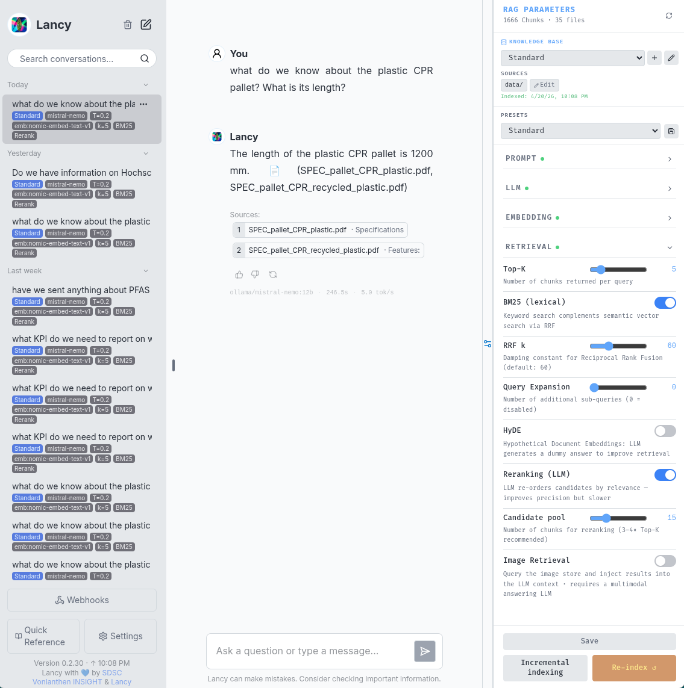

# Lancy — Open-Source RAG System

> Ask questions of your documents. See exactly how the answer was found.

Lancy is a self-hosted, production-ready Retrieval-Augmented Generation system.
It brings transparency to the RAG process: every response shows its sources, evidence quality,
retrieval settings, and generation stats — no black box. Investigate your document chunks with a retrieval explorer.

---

---

## Features

| Area | Description |
|------|-------------|
| **Multi-KB concurrent pool** | Multiple knowledge bases loaded simultaneously — different conversations can query different KBs at the same time, no restart required. All concurrently active KBs must share the same embedding backend and model; switching to a KB with a different embedding config requires a pool reset (`?reset=true`) |
| **Hybrid retrieval** | BM25 + semantic search fused via Reciprocal Rank Fusion (RRF) |
| **Query techniques** | Query expansion, HyDE, LLM reranking — all configurable per session |
| **Ingestion deduplication** | SHA-256 content hashing prevents duplicate chunks across runs and within a single batch — dedup happens before parsing, so no wasted embedding work |
| **Image retrieval** | Dual-collection pipeline: images extracted from PDFs and standalone files are embedded separately (Qwen3-VL) and injected into LLM context alongside text chunks |
| **Image captioning** | Optional KB-level feature: at ingest time the main LLM generates a text caption for each extracted image and stores it inline in the text chunk, making image content searchable via standard BM25/semantic/RRF retrieval without a separate VL model at query time |
| **Structured outputs** | Evidence-level tagging per claim: VERIFIED / CLAIMED / MISSING / MIXED |
| **RAG config panel** | Collapsible right-side panel with presets and live parameter tuning |
| **Retrieval Probe** | Test queries against the retrieval pipeline without the LLM — returns ranked chunks with per-method scores (BM25, semantic, RRF), reranking cut-off visualised, and a lookahead window showing what the RAG discards |
| **Chunk Browser** | Browse the raw vector store by metadata filter (file, author, document class, and more); paginated server-side so large KBs are never fully loaded; expandable rows render chunk content as markdown |
| **KB Analytics** | Pre-computed health dashboard per KB: chunk size distribution, chunks-per-document histogram, stacked ingestion history, and a summary strip with avg / P50 / P95 chunk sizes — zero query-time cost |
| **Transparent sessions** | Per-conversation config snapshot: KB · LLM · T= · emb: · k= · BM25 · Rerank · HyDE displayed as badges |
| **Generation stats** | Query duration, tokens/second, and model name shown per response |
| **Source citations** | Every answer links back to the source chunks it was grounded on |
| **Indexing control** | Real-time progress, mid-run cancellation, guard against concurrent indexing |
| **OpenAI-compatible API** | `POST /v1/chat/completions` — works with Open WebUI, curl, n8n, Cursor |
| **Multiple LLM backends** | Ollama (local), OpenAI, Anthropic, LiteLLM — switchable at runtime |
| **Multiple embedding backends** | `local` (SentenceTransformer, fully offline), `ollama`, `litellm`, `custom` |
| **Multiple vector stores** | ChromaDB (local, zero-config) or pgvector (PostgreSQL) — selectable per KB |
| **Document formats** | PDF, Markdown, XLSX, EPUB, DOCX |
| **Auth** | Three modes: shared password (Mode 1), role-separated passwords (Mode 2), or SSO via OIDC / LDAP / Active Directory (Mode 3) — switchable without code changes |
| **i18n** | DE / EN / FR / IT |

### Hybrid Retrieval

Lancy combines two complementary retrieval methods and fuses their results:

- **BM25** (Okapi BM25) — keyword-based sparse retrieval. Fast, interpretable, and strong on exact term matches, named entities, and domain-specific vocabulary that semantic models may not have seen during training.
- **Semantic search** — dense vector retrieval via cosine similarity against chunk embeddings. Captures meaning, synonyms, paraphrases, and cross-lingual matches where the query language differs from the document language.
- **RRF (Reciprocal Rank Fusion)** — merges the two ranked lists by position rather than raw score, avoiding the need to normalise incompatible score scales. Consistently outperforms either method alone on mixed corpora.

BM25 can be toggled per session from the RAG Config panel or the Retrieval Probe. Disabling BM25 falls back to pure semantic retrieval.

The RRF `k` constant (default 60) controls how steeply rank position is penalised. Each result's contribution is scored as `1 / (k + rank)`: a top-ranked result scores `1/61`, a result at rank 10 scores `1/70`, and so on. A higher `k` flattens the differences between ranks — making the fusion more democratic and less dominated by whichever method happened to rank something first. A lower `k` amplifies the advantage of top positions. The default of 60 is the value from the original RRF paper and works well in practice across a wide range of corpora.

### Query Techniques

Three optional pre-retrieval techniques address different failure modes. All are configurable per session from the RAG Config panel — no restart required.

- **Query expansion** — generates N reformulations of the original query using the LLM and runs each through retrieval independently. Results are merged before ranking. Improves recall when the user's phrasing does not match the document vocabulary (e.g. "energy use" vs. "power consumption").
- **HyDE (Hypothetical Document Embeddings)** — instead of embedding the question, the LLM generates a short hypothetical answer and that answer is embedded for semantic retrieval. Effective when questions and answers look very different semantically, which is common in technical or regulatory documents.
- **LLM reranking** — after retrieval, a second LLM pass scores each candidate chunk for relevance and reorders the list. Operates on a configurable candidate pool (default 15); only `top_k` results are returned. A separate `utility_llm_model` can be set to use a faster, smaller model for reranking without affecting the main response model.

### Retrieval Probe

The Retrieval Probe lets you test queries against the full retrieval pipeline without invoking the LLM for the final answer. Enter a question, choose which methods to run (BM25, semantic, hybrid), and get back a ranked list of chunks with scores broken out per method — BM25 score, cosine similarity, and fused RRF score shown individually for each result.

The result list visualises the `top_k` cut-off: chunks inside `top_k` render normally; chunks beyond it are dimmed and labelled, so you can see exactly what the RAG would discard. When reranking is enabled, the pool of reranker candidates is shown the same way. This makes the effect of tuning `top_k`, toggling BM25, or enabling reranking immediately legible without running a full chat query.

Accessible from the Retrieval Explorer page (`/explorer → Retrieval Probe tab`), alongside the RAG Config sidebar.

### Chunk Browser

The Chunk Browser exposes the raw contents of the vector store for inspection. Filter by source file using a typeahead input, or add metadata filter conditions (author, document class, chunk index, or any other stored field) to narrow results. Results are fetched with server-side pagination — only 50 rows at a time, never the full KB — with a "Load more" button to append the next page.

Results are displayed in a table with fixed baseline columns (`#`, File, Title, Index, Type) and additional columns derived automatically from whatever metadata keys are present in the result set. Clicking a row expands it to show the full chunk text, rendered as markdown. Useful for verifying that a document was indexed correctly, spotting bad chunking, and checking what metadata was stored alongside each chunk.

Accessible from the Retrieval Explorer page (`/explorer → Chunk Browser tab`).

### KB Analytics

The Analytics tab gives a health overview of any indexed Knowledge Base at a glance. Stats are pre-computed at the end of each indexing run and stored as a sidecar JSON file — the page loads instantly regardless of KB size.

Four panels are shown:

- **Summary strip** — total chunks, total documents, average / P50 (median) / P95 chunk size in characters.
- **Chunk size distribution** — bar chart in 200-character buckets (0–200 … 2000+). Reveals over-chunking, under-chunking, and outlier chunks from OCR noise or header/footer extraction.
- **Chunks per document** — histogram with one bar per integer 1–100 plus a `100+` bucket on the x-axis, and document count on the y-axis. Shows the shape of the distribution across the corpus without labelling individual files.
- **Ingestion history** — bar chart grouped by calendar day. Incremental runs and reset runs are shown as separately coloured segments in stacked bars, so multiple runs on the same day are not lost.

A KB selector at the top defaults to the active KB but can inspect any KB independently without switching the active one. The "Last updated" timestamp in the header reflects when that specific KB was last indexed.

Accessible from the Retrieval Explorer page (`/explorer → Analytics tab`).

---

## Documentation

- [Deployment Guide](docs/admin-guides/deployment.md) — installation, configuration, deployment profiles
- [Architecture](docs/ARCHITECTURE.md) — system design, retrieval pipeline, sequence diagrams
- [Codebase](docs/CODEBASE.md) — repository layout and module overview

---

## Demo Dataset (PrimePack AG)

The bundled dataset models **PrimePack AG**, a packaging company evaluating supplier sustainability claims.
It is designed for RAG stress-testing — evidence quality varies deliberately. Developed by SDSC.

| Prefix | Content |
|--------|---------|
| `ART_` | Artificial scenario documents with deliberate evidence flaws |
| `EPD_` | Third-party verified Environmental Product Declarations |
| `SPEC_` | Product specifications and datasheets |
| `REF_` | Regulatory reference documents (GHG Protocol, CSRD, ISO 14024) |
| `EVALUATION_` | Ground-truth Q&A pairs — not indexed, used for evaluation only |

Conflicts are intentional (old vs. new datasheet with different GWP figures).
The correct answer to missing data is "we don't know" — the system should say so.

---

## Contributing

Bug reports, feature requests, and pull requests are welcome. See [CONTRIBUTING.md](CONTRIBUTING.md) for guidelines.

---

## Intended Use & Security Notice

Lancy is designed for **on-premises deployment** — all data and LLM inference stay within your own infrastructure. No data leaves your network unless you configure an external LLM or embedding backend. Some components might check for updates online - isolate if desired.

This system is intended for **trusted internal networks** (corporate LAN, VPN, private server):

- Mode 3 (SSO) supports individual user accounts via an external IdP; Modes 1 and 2 use a shared password with no individual accounts
- No rate limiting or abuse protection on the API
- All indexed documents are accessible to anyone with the password

Restrict access at the network level (firewall, VPN, or reverse proxy with additional auth) before any broader deployment.

---

## The Name

The name Lancy was derived from *Calathea lancifolia*, the plant whose leaf is shown in the project icon. The name was intended to be something neutral, giving the project an abstract identity. Turns out it is also a town near Geneva, Switzerland - fitting for the project's origin.

---

## License & Credits

Apache License 2.0 — see [LICENSE](LICENSE).

**Copyright 2026 Swiss Data Science Center (SDSC), ETH Zürich / EPFL**
**Copyright 2026 Vonlanthen INSIGHT**
**Copyright 2026 rlei-odes**

Lancy is a fork of the [SDSC SME-KT-ZH Collaboration RAG](https://github.com/SwissDataScienceCenter/sme-kt-zh-collaboration-rag),
extended with a full production stack by [Vonlanthen INSIGHT](https://www.vonlanthen.tv)
and further developed as Lancy by [rlei-odes](https://github.com/rlei-odes).

See [CONTRIBUTORS.md](CONTRIBUTORS.md) for a detailed list of contributions.

Any fork or derivative must retain all copyright notices as required by the Apache License 2.0.
