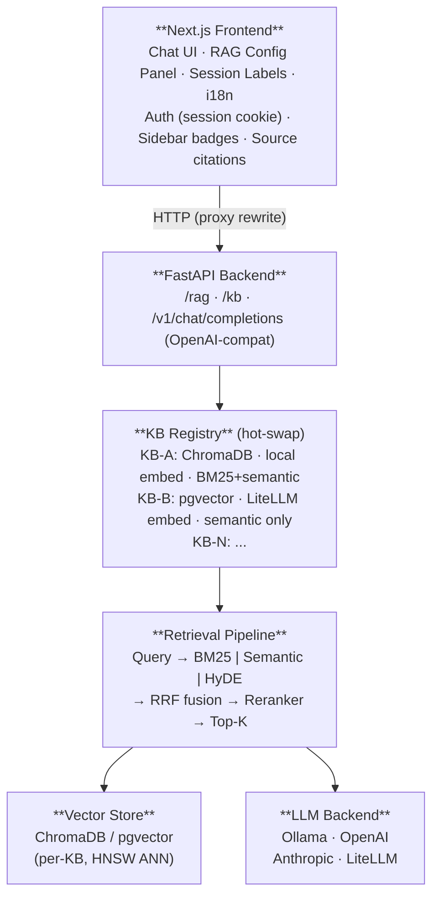

# Lancy — Open-Source RAG System

> Ask questions of your documents. See exactly how the answer was found.

Lancy is a self-hosted, production-ready Retrieval-Augmented Generation system.
It brings transparency to the RAG process: every response shows its sources, evidence quality,
retrieval settings, and generation stats — no black box.

---

<!-- Screenshot: replace docs/screenshots/Lancy_Frontend.png with a current capture before publishing -->

---

## Features

| Area | Description |
|------|-------------|
| **Multi-KB architecture** | Multiple independent knowledge bases with hot-swap — no restart required |
| **Hybrid retrieval** | BM25 + semantic search fused via Reciprocal Rank Fusion (RRF) |
| **Query techniques** | Query expansion, HyDE, LLM reranking — all configurable per session |
| **Ingestion deduplication** | SHA-256 content hashing prevents duplicate chunks across runs and within a single batch — dedup happens before parsing, so no wasted embedding work |
| **Image retrieval** | Dual-collection pipeline: images extracted from PDFs and standalone files are embedded separately (Qwen3-VL) and injected into LLM context alongside text chunks |
| **Structured outputs** | Evidence-level tagging per claim: VERIFIED / CLAIMED / MISSING / MIXED |
| **RAG config panel** | Collapsible right-side panel with presets and live parameter tuning |
| **Transparent sessions** | Per-conversation config snapshot: KB · LLM · T= · emb: · k= · BM25 · Rerank · HyDE displayed as badges |
| **Generation stats** | Query duration, tokens/second, and model name shown per response |
| **Source citations** | Every answer links back to the source chunks it was grounded on |
| **Indexing control** | Real-time progress, mid-run cancellation, guard against concurrent indexing |
| **OpenAI-compatible API** | `POST /v1/chat/completions` — works with Open WebUI, curl, n8n, Cursor |
| **Multiple LLM backends** | Ollama (local), OpenAI, Anthropic, LiteLLM — switchable at runtime |
| **Multiple embedding backends** | `local` (SentenceTransformer, fully offline), `ollama`, `litellm`, `custom` |
| **Multiple vector stores** | ChromaDB (local, zero-config) or pgvector (PostgreSQL) — selectable per KB |
| **Document formats** | PDF, Markdown, XLSX, EPUB, DOCX |
| **Auth** | Password-protected login via session cookie (`API_KEY` in `.env`) |
| **i18n** | DE / EN / FR / IT |

---

## Architecture



See [ARCHITECTURE.md](ARCHITECTURE.md) for the full technical deep-dive.

---

## Quick Start

### Requirements

- Python ≥ 3.12
- Node.js ≥ 18
- [Ollama](https://ollama.com) for local LLM inference (optional — OpenAI and LiteLLM also work)

### One-command start

```bash
./start.sh   # starts backend (port 8080) and frontend (port 3000)
./stop.sh
```

Logs are written to `logs/backend.log` and `logs/frontend.log`.

### Manual setup

```bash
# Backend
python -m venv .venv
source .venv/bin/activate
pip install -r requirements.txt

# Frontend
cd frontend
cp .env.example .env   # set API_KEY (login password) and optionally BACKEND_URL
npm install
npm run dev
```

### First run — create a Knowledge Base

1. Log in at `http://localhost:3000`
2. Open the **RAG Parameters** panel (right side)
3. Click **+** next to the knowledge base selector
4. Enter a name and the path to your documents (e.g. `data/`)
5. Choose an embedding backend (default: local SentenceTransformer — no API key needed)
6. Click **Re-index** — progress shows file and chunk counts in real time
7. Start asking questions

---

## Environment Variables

### Backend

| Variable | Required for | Example |
|----------|-------------|---------|
| `BACKEND` | All | `ollama` / `openai` / `litellm` / `anthropic` |
| `OPENAI_API_KEY` | OpenAI LLM or embedding | `sk-...` |
| `ANTHROPIC_API_KEY` | Anthropic LLM | `sk-ant-...` |
| `LITELLM_BASE_URL` | LiteLLM proxy | `https://your-litellm/v1` |
| `LITELLM_API_KEY` | LiteLLM proxy | `sk-...` |
| `ALLOW_ORIGINS` | CORS config | `http://localhost:3000` |

### Frontend (`.env`)

| Variable | Description |
|----------|-------------|
| `API_KEY` | Login password for the web UI |
| `BACKEND_URL` | Backend URL for server-side proxy. Default: `http://localhost:8080` |
| `SERVER_URL` | Override for browser-side API calls. **Leave empty** for same-origin proxy. |

> `SERVER_URL` must be empty on local and NAT networks. Setting it to a hostname routes API calls externally and breaks the proxy.

---

## Deployment (systemd + nginx)

```bash
cp insight-backend.service ~/.config/systemd/user/
cp insight-frontend.service ~/.config/systemd/user/

systemctl --user daemon-reload
systemctl --user enable --now insight-backend insight-frontend

journalctl --user -u insight-backend -f   # live logs
```

A sample nginx reverse proxy configuration is included in `nginx.conf`.

---

## Repository Structure

```
.
├── backend/
│   └── src/lancy/
│       ├── main.py                   # FastAPI entry point
│       ├── kb_router.py              # KB registry, hot-swap, indexing control
│       ├── rag_router.py             # RAG query endpoints
│       ├── openai_compat_router.py   # /v1/chat/completions endpoint
│       └── feature0_baseline_rag.py  # RAG pipeline factories and ingestion
│
├── conversational-toolkit/
│   └── src/conversational_toolkit/
│       ├── agents/                   # RAG agent (retrieval + generation)
│       ├── api/                      # FastAPI server and routes
│       ├── chunking/                 # PDF, EPUB, DOCX, Markdown chunkers
│       ├── embeddings/               # SentenceTransformer, Ollama, LiteLLM
│       ├── llms/                     # OpenAI, Ollama, Anthropic, LiteLLM
│       ├── retriever/                # BM25, semantic, hybrid retriever
│       └── vectorstores/             # ChromaDB, pgvector
│
├── frontend/
│   └── src/
│       ├── components/sections/
│       │   ├── rag-config-panel.tsx  # RAG Parameters panel
│       │   └── sidebar/              # History, session labels, config badges
│       └── pages/
│           ├── login.tsx
│           └── api/auth/
│
├── data/                             # Demo document corpus (PrimePack AG scenario)
├── docs/
├── prompts/                          # system_prompt.default.md + custom (gitignored)
├── ARCHITECTURE.md
├── CHANGELOG.md
├── CONTRIBUTORS.md
└── LICENSE
```

---

## Demo Dataset (PrimePack AG)

The bundled dataset models **PrimePack AG**, a packaging company evaluating supplier sustainability claims.
It is designed for RAG stress-testing — evidence quality varies deliberately.

| Prefix | Content |
|--------|---------|
| `ART_` | Artificial scenario documents with deliberate evidence flaws |
| `EPD_` | Third-party verified Environmental Product Declarations |
| `SPEC_` | Product specifications and datasheets |
| `REF_` | Regulatory reference documents (GHG Protocol, CSRD, ISO 14024) |
| `EVALUATION_` | Ground-truth Q&A pairs — not indexed, used for evaluation only |

Conflicts are intentional (old vs. new datasheet with different GWP figures).
The correct answer to missing data is "we don't know" — the system should say so.

---

## Contributing

Contributions are welcome — retrieval strategies, chunkers, frontend improvements, bug fixes.

```bash
git checkout -b feature/my-feature
git push origin feature/my-feature
# open a pull request
```

---

## Intended Use & Security Notice

Lancy is designed for **on-premises deployment** — all data and LLM inference stay within your own infrastructure. No data leaves your network unless you configure an external LLM or embedding backend. Some components might check for updates online - isolate if desired.

This system is intended for **trusted internal networks** (corporate LAN, VPN, private server):

- Authentication is a single shared password — no individual user accounts
- No rate limiting or abuse protection on the API
- All indexed documents are accessible to anyone with the password

Restrict access at the network level (firewall, VPN, or reverse proxy with additional auth) before any broader deployment.

---

## The Name

Lancy comes from *Calathea lancifolia*, the plant in the project icon. Turns out it is also a town near Geneva, Switzerland - fitting for the project's origin.

---

## License & Credits

Apache License 2.0 — see [LICENSE](LICENSE).

**Copyright 2026 Swiss Data Science Center (SDSC), ETH Zürich / EPFL**
**Copyright 2026 Vonlanthen INSIGHT**
**Copyright 2026 rlei-odes**

Lancy is a fork of the [SDSC SME-KT-ZH Collaboration RAG](https://github.com/SwissDataScienceCenter/sme-kt-zh-collaboration-rag),
extended with a full production stack by [Vonlanthen INSIGHT](https://www.vonlanthen.tv)
and further developed as Lancy by [rlei-odes](https://github.com/rlei-odes).

See [CONTRIBUTORS.md](CONTRIBUTORS.md) for a detailed list of contributions.

Any fork or derivative must retain all copyright notices as required by the Apache License 2.0.
