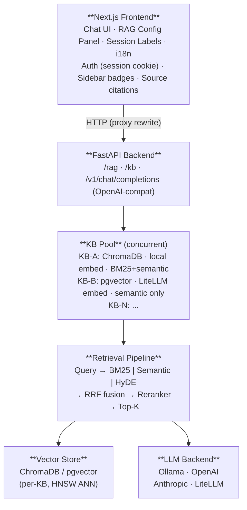

# Lancy — Architecture Reference

---

## Overview



Lancy is a full-stack RAG system structured in three layers:

```
Frontend (Next.js)
  ↕ HTTP (same-origin proxy rewrite — no CORS issues)
Backend (FastAPI + asyncio)
  ↕ per-KB config
Vector Store(s) · Embedding Backend(s) · LLM Backend(s)
```

Everything is **async** — the FastAPI backend uses `asyncio` throughout with
`loop.run_in_executor` for CPU-bound operations (embedding inference, BM25 indexing).
This prevents the SSE/streaming endpoint from blocking under concurrent load.

---

## Backend

### Entry Point

`backend/src/lancy/main.py`

FastAPI application with three routers:

| Router | Prefix | Purpose |
|--------|--------|---------|
| `rag_router` | `/rag` | Query endpoint, streaming responses |
| `kb_router` | `/kb` | KB management: list, create, switch, index, cancel |
| `openai_compat_router` | `/v1` | OpenAI-compatible chat completions |

The conversational toolkit (`conversational-toolkit/`) is a separate installable package
providing the core primitives: agents, embeddings, LLMs, vector stores, chunkers, retriever.

### KB Pool

`backend/src/lancy/kb_pool.py` · `backend/src/lancy/kb_router.py`

```
knowledge_bases.json              persisted registry (kb_router.py)
  └── KB definitions: id, name, data_dirs, embedding_backend, embedding_model, ...

KBPool                            in-memory pool (kb_pool.py)
  ├── _pool: dict[kb_id, LoadedKB]   ← all currently loaded KBs
  ├── _emb: shared embedding model   ← one instance, shared across KBs
  ├── _emb_key: (backend, model)     ← pool is locked to this embedding config
  └── _active_id: str                ← the "current" KB for new conversations

LoadedKB
  ├── kb: KBInfo       ← config snapshot
  ├── vs: VectorStore  ← per-KB vector store
  ├── agent: CustomRAG ← per-KB RAG agent
  └── probe_bm25: BM25Retriever | None  ← lazy BM25 cache for Retrieval Probe

DispatchingAgent
  └── answer_stream(query) → resolves KB from conversation.kb_id → delegates to entry.agent
```

**Concurrent activation:** `POST /kb/{id}/activate` **adds** the KB to the pool — the
previous KB stays loaded and available for in-flight conversations. The pool's `active_id`
is updated so new conversations default to the activated KB.

**Embedding compatibility:** All KBs in the pool must share the same `(embedding_backend,
embedding_model)` pair, because the embedding model is instantiated once and shared. Adding
a KB with a different embedding config raises `EmbeddingConflict` (HTTP 409). Pass
`?reset=true` to clear the pool first and reload with the new config.

**Per-conversation routing:** `DispatchingAgent` reads `conversation.kb_id` from the DB
on each query and dispatches to the matching pool entry. Falls back to the active KB when
no match is found (e.g. conversation predates multi-KB support).

**Unloading:** `POST /kb/{id}/deactivate` removes a KB from the pool. In-flight streams
hold a local reference to the `LoadedKB` and complete safely — Python's reference counting
prevents premature GC.

**Indexing:** `POST /kb/{id}/reindex` runs in a background thread via `run_in_executor`.
A `_cancel_requested` global flag enables mid-indexing cancellation. The endpoint returns
a 409 if indexing is already running.

**Document Upload:** `POST /kb/{id}/documents` accepts a multipart file + JSON metadata,
saves it to a temp path, and triggers the same ingestion pipeline via `BackgroundTasks`.
The temp file is always deleted after ingestion. Requires a stable `document_id` in metadata;
re-uploading the same `document_id` replaces the existing chunks (delete-then-insert).

### Ingestion Pipeline

Ingestion converts documents on disk into embedded chunks stored in the vector store.
It is triggered by `POST /api/v1/rag/reindex` or automatically on startup when the
store is empty.

#### Flow

```
POST /reindex (reset: bool)
  │
  ├── run_ingestion(kb, reset, db_dir)         ingestion.py
  │     │
  │     ├── make_vector_store(...)             create VS instance in async context
  │     │     (ChromaDB: reused below;
  │     │      PGVector: new instance per thread — AsyncEngine is loop-bound)
  │     │
  │     ├── [if not reset] vs.get_file_hashes()
  │     │     returns set[SHA-256] already in the store
  │     │     warns if store is non-empty but has no hashes (pre-dedup KB)
  │     │
  │     ├── executor: _prepass()               blocking I/O — thread pool
  │     │     ├── _collect_candidate_files()   extension + size + EVALUATION filter
  │     │     ├── file_hash(path) × N          SHA-256 of raw bytes, one per file
  │     │     ├── cross-run dedup              skip if hash in existing_hashes
  │     │     └── within-batch dedup           skip if hash already seen this run
  │     │                                      (add to seen_hashes only on success)
  │     │
  │     ├── executor: load_chunks(             blocking I/O + CPU — thread pool
  │     │     include_files=filtered,
  │     │     file_hashes=hash_map)
  │     │     └── per file: parse → chunk → stamp chunk.metadata["file_hash"]
  │     │
  │     └── executor/new-loop: build_vector_store(   CPU-bound — separate thread
  │           chunks, embedding_model,
  │           existing_hashes=existing_hashes)
  │           ├── [if reset] clear collection
  │           ├── group chunks by file_hash
  │           ├── skip groups already in store  (belt-and-suspenders)
  │           └── embed + insert remaining chunks in batches
  │
  └── returns ReindexResult(chunks_indexed, files_processed, files_skipped, reset)
```

#### Deduplication: Two Layers

| Layer | Where | What it skips |
|-------|-------|---------------|
| Cross-run | Pre-pass | Files whose hash is already in the vector store — no parsing, no embedding |
| Within-batch | Pre-pass | Files with identical content to another file in the same run — only the first occurrence is processed |

Both layers operate before `load_chunks`, so expensive PDF parsing is never wasted on
a file that would ultimately be discarded.

`reset=True` bypasses cross-run dedup (store is cleared). Within-batch dedup still
applies — two identical files in one run always produce one set of chunks.

#### Key Functions

| Function | File | Role |
|----------|------|------|
| `file_hash(path)` | `feature0_baseline_rag.py` | SHA-256 of raw file bytes |
| `_collect_candidate_files(dirs, ...)` | `feature0_baseline_rag.py` | Extension + size + EVALUATION filter, shared by pre-pass and `load_chunks` |
| `load_chunks(..., include_files, file_hashes)` | `feature0_baseline_rag.py` | Parse files, stamp `chunk.metadata["file_hash"]` |
| `build_vector_store(..., existing_hashes)` | `feature0_baseline_rag.py` | Embed and persist; skips chunks already in store |
| `VectorStore.get_file_hashes()` | `vectorstores/base.py` | Abstract: return set of hashes in the store |
| `run_ingestion(kb, reset, db_dir)` | `ingestion.py` | Orchestrates all steps above; returns `(chunks, files, skipped)` |

#### Threading Model

The ingestion pipeline has three distinct blocking phases, each isolated to avoid
blocking the FastAPI event loop:

```
async context (run_ingestion)
  │
  ├── await vs.get_file_hashes()      [async — ChromaDB uses run_in_executor internally]
  │
  ├── await run_in_executor(_prepass) [blocking I/O: file discovery + SHA-256 hashing]
  │
  ├── await run_in_executor(load_chunks) [blocking I/O + CPU: PDF parsing, chunking]
  │
  └── await run_in_executor(_sync_build_vs)
        └── new_loop.run_until_complete(build_vector_store(...))
              [CPU-bound: SentenceTransformer.encode() — needs its own event loop]
```

`_sync_build_vs` creates a fresh event loop because `SentenceTransformer.encode()`
and the subsequent `insert_chunks` calls must complete synchronously from the thread's
perspective. For PGVector, a new `AsyncEngine` is created inside this thread (engine
is bound to the loop that created it and cannot be shared across loops).

---

### Retrieval Pipeline

`conversational-toolkit/src/conversational_toolkit/retriever/`

```
Query
  ↓
[Optional] Query Expansion
  → LLM generates N rephrased variants
  → each variant retrieves independently

[Optional] HyDE
  → LLM generates a hypothetical answer document
  → hypothetical doc is embedded (not the original query)
  → embedded HyDE vector used for ANN search

[Parallel]
  → BM25 retrieval (sparse, term-frequency based)
  → Semantic retrieval (ANN on query/HyDE embedding)

[RRF Fusion]
  → Reciprocal Rank Fusion merges ranked lists
  → Score: Σ 1 / (k + rank_i)   (k=60 default)

[Optional] LLM Reranking
  → Cross-encoder or LLM scores each candidate
  → Final Top-K selected

→ Top-K chunks passed to generator
```

### Vector Stores

| Backend | Class | When to use |
|---------|-------|-------------|
| `chromadb` | `ChromaDBVectorStore` | Default, local, no dependencies |
| `pgvector` | `PgVectorVectorStore` | PostgreSQL available, larger scale, SQL filtering |

Both backends:
- Use HNSW index for ANN search
- Support metadata filtering (source file, page number)
- Store chunk text + embedding + metadata per document

### Embedding Backends

| Backend | Class | Notes |
|---------|-------|-------|
| `local` | `SentenceTransformerEmbeddings` | Fully offline, CPU/GPU, default |
| `ollama` | `OllamaEmbeddings` | Local Ollama server |
| `litellm` | `LiteLLMEmbeddings` | Any OpenAI-compatible embed endpoint |
| `custom` | `CustomEmbeddings` | Custom base URL + model |

**Dimension lock:** A ChromaDB collection is created with the dimension of the first
embedding. Changing embedding model after indexing requires a full re-index with `reset=True`.

### LLM Backends

| Backend | Class | Notes |
|---------|-------|-------|
| `ollama` | `OllamaLLM` | Local inference, privacy-preserving |
| `openai` | `OpenAILLM` | OpenAI API |
| `anthropic` | `AnthropicLLM` | Anthropic API |
| `litellm` | `LiteLLMLLM` | LiteLLM proxy — routes to any provider |

All LLM backends implement the same interface (`BaseLLM.stream()`), so the retrieval
pipeline and agent are backend-agnostic.

### OpenAI-Compatible Endpoint

`backend/src/lancy/openai_compat_router.py`

```
POST /v1/chat/completions
  → routed by DispatchingAgent (resolves KB from conversation_id, falls back to active KB)
  → returns OpenAI-format response (streaming supported)

GET /v1/models
  → returns available KBs as model list
```

Any OpenAI-compatible client (Open WebUI, curl, n8n, Cursor) can point to this endpoint
with `base_url=http://localhost:8080/v1` and `api_key=<anything>`.

### Async Architecture

Critical for production: all blocking operations use `run_in_executor`:

```python
# Embedding inference (CPU-bound)
loop = asyncio.get_event_loop()
embeddings = await loop.run_in_executor(None, model.encode, texts)

# ChromaDB operations (I/O + Python GIL)
results = await loop.run_in_executor(None, collection.query, ...)
```

Without this, the SSE streaming endpoint blocks under load — the frontend shows a frozen
response until the full generation completes.

---

## Frontend

### Tech Stack

- Next.js 15 (Pages Router)
- TypeScript
- Tailwind CSS
- shadcn/ui components

### API Routing

The frontend uses Next.js **API route rewrites** to proxy backend calls:

```
Browser → GET /api/rag/query
  → Next.js API route
  → fetches http://BACKEND_URL/rag/query (server-side)
  → streams response back to browser
```

Set `BACKEND_URL` in `frontend/.env` to point at the backend host when running on separate machines.

### RAG Config Panel

`frontend/src/components/sections/rag-config-panel.tsx`

Right-side collapsible panel exposing all RAG parameters:
- Knowledge base selector — compatible KBs selectable normally; incompatible KBs greyed out (user) or red+⚠ (admin, triggers pool reset); controls lock with a spinner while a KB is loading
- LLM model and temperature
- Embedding backend and model
- Retrieval: k, BM25 on/off, HyDE on/off, Query Expansion on/off, Reranking on/off
- Presets (fast / balanced / quality)
- Re-index / cancel indexing controls with live progress

All settings are persisted in `rag_config.json` and snapshotted per conversation.

### Session Labels & Badges

Each conversation stores a `rag_config_snapshot` at creation time. The sidebar renders
badges showing the full config: `KB · LLM · T= · emb: · k= · BM25 · Rerank · HyDE`.

Session labels group conversations for A/B evaluation runs: label two sessions,
run the same questions with different configs, compare outputs.

### Auth

Auth lives entirely in the **Next.js layer** — the FastAPI backend is unprotected at the network level and relies on the frontend proxy as its sole entry point in a normal deployment.

**Key files:**

| File | Role |
|------|------|
| `frontend/src/middleware.ts` | Guards every route; verifies the session cookie on each request |
| `frontend/src/pages/api/auth/login.ts` | Accepts password, determines role, issues signed cookie |
| `frontend/src/pages/api/auth/me.ts` | Returns `{ role }` for the current session |
| `frontend/src/pages/api/auth/admin-config.ts` | GET: returns active mode. POST: sets/clears admin password |
| `frontend/src/lib/auth.ts` | `signToken()` / `verifyToken()` — HMAC-SHA256, works in Edge + Node |
| `frontend/src/lib/auth-config.ts` | Reads/writes `auth_config.json` (gitignored, Node.js only) |
| `frontend/src/hooks/useRole.ts` | React hook — calls `/api/auth/me`, returns current role |

**Session cookie:** `rag_auth` holds an HMAC-SHA256 signed token in the format `role.expiry_unix.hex_sig`. The role (`admin` or `user`) is embedded in the token and verified by the middleware using `APP_PASSWORD` as the signing key. No role string is stored in an unsigned cookie.

#### Access modes

Three modes are planned, with increasing complexity:

**Mode 1 — single password (default)**
All users who log in share one password (`APP_PASSWORD`). Every session is treated as admin. No `auth_config.json` present.

**Mode 2 — role separation (two passwords)**
Activated by setting an admin password via Settings → Role Separation. The admin password is stored in `frontend/auth_config.json` (gitignored) or the `ADMIN_PASSWORD` env var (for scripted deployments).

- `APP_PASSWORD` → user role: read-only view of RAG config, session retrieval settings only
- `ADMIN_PASSWORD` → admin role: full config access, reindexing, preset management, system prompt

The active mode is determined at login time. `middleware.ts` only needs `APP_PASSWORD` (to verify the signed token); it does not need to know `ADMIN_PASSWORD`.

**Mode 3 — external directory / SSO (planned)**
AD/LDAP bind or OAuth/OIDC. Group membership maps to roles. The `getRole()` function in `middleware.ts` is the seam — replacing its implementation is sufficient to add an external provider. The two-password model remains as a fallback admin credential that works without the directory.

#### Two-cookie coexistence

Two cookies exist simultaneously in a logged-in browser session:

| Cookie | Set by | Purpose |
|--------|--------|---------|
| `rag_auth` | Next.js login endpoint | Auth gate + role — verified by middleware on every request |
| `access_token` | Backend `SessionCookieProvider` | Per-browser identity for conversation history scoping |

`access_token` currently resolves every browser to the hardcoded identity `"admin"`. The original code generated a unique per-browser UUID here; a comment marks the spot for re-enabling it when per-user session isolation is introduced in Mode 3.

---

## Sequence Diagram — Query Flow

```
User            Frontend        Backend         VectorStore     LLM
 │                │               │                 │             │
 │──── query ────►│               │                 │             │
 │                │──── POST ────►│                 │             │
 │                │         [Query Expansion?]       │             │
 │                │               │──── embed ─────►│             │
 │                │               │◄─── vectors ────│             │
 │                │               │                 │             │
 │                │         [HyDE?] generate hypothetical          │
 │                │               │────────────────────────────►  │
 │                │               │◄─── hypothetical doc ──────── │
 │                │               │──── embed hypo ─►│            │
 │                │               │                  │            │
 │                │         [BM25 + Semantic parallel]│            │
 │                │               │──── ANN query ──►│            │
 │                │               │◄─── top-K chunks─│            │
 │                │               │                  │            │
 │                │         [RRF fusion → Rerank?]    │            │
 │                │               │                  │            │
 │                │         Build prompt (system + chunks + query) │
 │                │               │────────────────────────────►  │
 │                │         stream tokens                          │
 │                │◄── SSE ───────│◄─── token ──────────────────  │
 │◄─ token ───────│               │                 │             │
```
